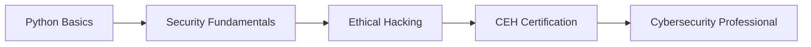

# Hi there, I'm Rohith D! 👋

<div align="center">
  
</div>

## 🛡️ About Me

- 🔐 **Cybersecurity Enthusiast** passionate about ethical hacking and security
- 🐍 **Python Programmer** building automation and security tools
- 📚 Currently pursuing **CEH (Certified Ethical Hacker)** certification
- 🎓 Completed **EC-Council Python Programming Course**
- 🌱 Learning penetration testing, malware analysis, and network security
- 📍 Based in **Chennai, India**
- 💼 Open to entry-level cybersecurity roles and internships

## 🚀 Current Focus

```python
class CybersecurityJourney:
    def __init__(self):
        self.current_role = "Aspiring Security Analyst"
        self.learning = ["Python", "Ethical Hacking", "Network Security"]
        self.certifications_in_progress = ["CEH"]
        self.goal = "Become a skilled Cybersecurity Professional"
    
    def daily_routine(self):
        return "Learn → Practice → Build → Repeat"
```

## 🛠️ Technical Skills

### Programming & Scripting


### Cybersecurity


### Tools & Technologies


## 📊 GitHub Stats

<div align="center">
  
  
</div>

<div align="center">
  
</div>

## 📂 Featured Projects

### 🐍 Python Cybersecurity Notes
[](https://github.com/ROHITHD300900/Python-Cybersecurity-Notes)

Comprehensive Python programming notes from EC-Council course, covering:
- Core Python fundamentals
- Security-relevant programming concepts
- Practical implementations and projects
- Foundation for cybersecurity automation

## 🎯 Learning Path



## 📫 Connect With Me

<div align="center">
  
[](https://linkedin.com/in/rohith-d-a46aaa288)
[](https://github.com/ROHITHD300900)
[](mailto:your.email@example.com)

</div>

## 💡 Quick Facts

- ⚡ **Fun fact**: Started learning cybersecurity to understand how systems can be secured
- 🎯 **2025 Goal**: Obtain CEH certification and land my first cybersecurity role
- 📖 **Currently Reading**: Security best practices and penetration testing methodologies
- 🔧 **Working On**: Building security automation scripts with Python

## 🏆 Certifications & Courses

- ✅ **EC-Council Python Programming Course** - Completed
- 🔄 **Certified Ethical Hacker (CEH)** - In Progress
- 🎯 **Future**: OSCP, Security+, and more

---

<div align="center">
  
### 🌟 "Learning to hack for good, one line of code at a time" 🌟


</div>

---

<div align="center">
  <i>⭐ Feel free to explore my repositories and connect with me!</i>

---

## 💼 Professional Highlights

<div align="center">

### 🎯 What I Bring to Your Team

<table>
<tr>
<td align="center" width="33%">

<br><br>
<b>🛡️ Security-First Approach</b>
<br>
<sub>Ethical hacking principles applied to every line of code. Building secure systems from the ground up.</sub>
</td>
<td align="center" width="33%">

<br><br>
<b>📚 Always Growing</b>
<br>
<sub>Currently pursuing CEH certification. Completed EC-Council Python course. Never stop improving.</sub>
</td>
<td align="center" width="33%">

<br><br>
<b>🧩 Solution-Oriented</b>
<br>
<sub>Combining automation skills with security knowledge to solve real-world challenges.</sub>
</td>
</tr>
</table>

</div>

---

## 🚀 Current Projects & Focus

```python
class CurrentJourney:
    def __init__(self):
        self.status = "Actively seeking cybersecurity opportunities"
        self.focus_areas = [
            "Penetration Testing",
            "Security Automation",
            "Network Security",
            "Python Development"
        ]
        self.open_to = {
            "roles": ["Junior Security Analyst", "SOC Analyst", "Penetration Tester"],
            "internships": True,
            "collaborations": True
        }
    
    def current_mission(self):
        return "Building practical security tools and documenting my learning journey"

me = CurrentJourney()
print(f"Status: {me.current_mission()}")
# Output: Status: Building practical security tools and documenting my learning journey
```

---

## 📬 Let's Connect!

<div align="center">

### I'm always open to discussing:
- 🔐 Cybersecurity opportunities and internships
- 🤝 Collaboration on security projects
- 💡 Ideas about ethical hacking and penetration testing
- 📖 Knowledge sharing in the security community

<br>

[](https://www.linkedin.com/in/rohith-d-a46aaa288/)
[](mailto:rohithd300900@gmail.com)

<br>

### 💭 Daily Motivation

*"The only way to do great work is to love what you do. Stay curious, stay ethical, stay secure!"*

---


</div>
</div>
